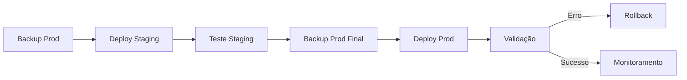

# 🗄️ BACKUP E RESTORE - SISTEMA SAGA

## 📋 Índice

1. [Visão Geral](#visão-geral)
2. [Backup Automático](#backup-automático)
3. [Backup Manual](#backup-manual)
4. [Restore de Dados](#restore-de-dados)
5. [Migração Entre Ambientes](#migração-entre-ambientes)
6. [Scripts Automatizados](#scripts-automatizados)
7. [Boas Práticas](#boas-práticas)

---

## 🎯 Visão Geral

O sistema SAGA utiliza **PostgreSQL** como banco de dados principal. Este guia aborda:

- **Backup completo** do banco de dados
- **Restore seletivo** por ambiente (dev/staging/prod)
- **Migração** entre servidores
- **Seeders** para dados iniciais
- **Scripts automatizados** para manutenção

### 📊 Estrutura de Dados

```
SAGA Database
├── organizations (Organizações Militares)
├── ranks (Postos e Graduações) 
├── users (Usuários do Sistema)
├── bookings (Reservas de Refeições)
├── weekly_menus (Cardápios Semanais)
└── sessions (Sessões de Usuário)
```

---

## ⚡ Backup Automático

### 1. Script de Backup Diário

```bash
#!/bin/bash
# backup-daily.sh

BACKUP_DIR="/home/saga/backups"
DATE=$(date +%Y%m%d_%H%M%S)
CONTAINER_NAME="saga_db"  # ou saga_db_staging para staging

# Criar diretório se não existir
mkdir -p $BACKUP_DIR

# Backup completo
docker exec $CONTAINER_NAME pg_dump -U saga_user -d saga \
  --clean --create --if-exists \
  > "$BACKUP_DIR/saga_backup_$DATE.sql"

# Backup apenas dados (sem estrutura)
docker exec $CONTAINER_NAME pg_dump -U saga_user -d saga \
  --data-only --inserts \
  > "$BACKUP_DIR/saga_data_only_$DATE.sql"

# Compactar
gzip "$BACKUP_DIR/saga_backup_$DATE.sql"
gzip "$BACKUP_DIR/saga_data_only_$DATE.sql"

# Manter apenas últimos 30 dias
find $BACKUP_DIR -name "*.gz" -mtime +30 -delete

echo "Backup concluído: saga_backup_$DATE.sql.gz"
```

### 2. Configuração no Crontab

```bash
# Editar crontab
crontab -e

# Adicionar linha para backup diário às 02:00
0 2 * * * /home/saga/scripts/backup-daily.sh >> /var/log/saga-backup.log 2>&1
```

---

## 🔧 Backup Manual

### 1. Backup Completo (Estrutura + Dados)

```bash
# Development Environment
docker exec saga_db pg_dump -U saga_user -d saga \
  --clean --create --if-exists \
  > "backup_dev_$(date +%Y%m%d_%H%M%S).sql"

# Staging Environment  
docker exec saga_db_staging pg_dump -U saga_user -d saga_staging \
  --clean --create --if-exists \
  > "backup_staging_$(date +%Y%m%d_%H%M%S).sql"
```

### 2. Backup Apenas Dados

```bash
# Apenas dados (para migrar entre ambientes)
docker exec saga_db pg_dump -U saga_user -d saga \
  --data-only --inserts \
  > "data_only_$(date +%Y%m%d_%H%M%S).sql"
```

### 3. Backup Específico por Tabela

```bash
# Backup apenas de usuários
docker exec saga_db pg_dump -U saga_user -d saga \
  --table=users --data-only --inserts \
  > "users_backup_$(date +%Y%m%d_%H%M%S).sql"

# Backup apenas de reservas
docker exec saga_db pg_dump -U saga_user -d saga \
  --table=bookings --data-only --inserts \
  > "bookings_backup_$(date +%Y%m%d_%H%M%S).sql"
```

---

## 🔄 Restore de Dados

### 1. Restore Completo

```bash
# ⚠️ ATENÇÃO: Isto irá sobrescrever TODOS os dados!

# Parar aplicação
docker-compose stop app

# Restore completo
docker exec -i saga_db psql -U saga_user -d saga < backup_file.sql

# Reiniciar aplicação
docker-compose start app
```

### 2. Restore em Banco Limpo

```bash
# Recriar banco completamente
docker-compose down
docker volume rm saga_postgres_data
docker-compose up -d database

# Aguardar inicialização do banco
sleep 10

# Restore
docker exec -i saga_db psql -U saga_user -d saga < backup_file.sql
```

### 3. Restore Seletivo

```bash
# Restore apenas dados específicos (ex: usuarios)
docker exec -i saga_db psql -U saga_user -d saga < users_backup.sql

# Restore apenas estrutura (sem dados)
docker exec saga_db pg_restore -U saga_user -d saga \
  --schema-only backup_file.dump
```

---

## 🔀 Migração Entre Ambientes

### 1. Dev → Staging

```bash
# 1. Backup do desenvolvimento
docker exec saga_db pg_dump -U saga_user -d saga \
  --data-only --inserts > dev_data.sql

# 2. Limpar staging (manter estrutura)
docker exec saga_db_staging psql -U saga_user -d saga_staging \
  -c "TRUNCATE TABLE bookings, users RESTART IDENTITY CASCADE;"

# 3. Importar dados
docker exec -i saga_db_staging psql -U saga_user -d saga_staging < dev_data.sql

# 4. Limpar caches
docker exec saga_app_staging php artisan cache:clear
docker exec saga_app_staging php artisan view:clear
```

### 2. Produção → Dev (para debugging)

```bash
# 1. Backup produção (apenas estrutura essencial)
ssh usuario@servidor-prod 'docker exec saga_db pg_dump -U saga_user -d saga \
  --table=organizations --table=ranks --data-only --inserts' > prod_reference.sql

# 2. Aplicar no desenvolvimento  
docker exec -i saga_db psql -U saga_user -d saga < prod_reference.sql
```

---

## 🤖 Scripts Automatizados

### 1. Script Completo de Backup

```bash
#!/bin/bash
# scripts/database/backup.sh

set -e

# Configurações
SCRIPT_DIR="$(cd "$(dirname "${BASH_SOURCE[0]}")" && pwd)"
PROJECT_ROOT="$(dirname "$(dirname "$SCRIPT_DIR")")"
BACKUP_DIR="$PROJECT_ROOT/backups"
DATE=$(date +%Y%m%d_%H%M%S)

# Cores para output
RED='\033[0;31m'
GREEN='\033[0;32m'
YELLOW='\033[1;33m'
NC='\033[0m' # No Color

echo -e "${YELLOW}🗄️ SAGA - Sistema de Backup${NC}"
echo "=================================================="

# Verificar se containers estão rodando
if ! docker ps | grep -q saga_db; then
    echo -e "${RED}❌ Container saga_db não está rodando!${NC}"
    exit 1
fi

# Criar diretório de backup
mkdir -p "$BACKUP_DIR"

# Funções de backup
backup_environment() {
    local env=$1
    local container=$2
    local database=$3
    
    echo -e "${YELLOW}📦 Fazendo backup do ambiente: $env${NC}"
    
    # Backup completo
    docker exec "$container" pg_dump -U saga_user -d "$database" \
        --clean --create --if-exists \
        > "$BACKUP_DIR/saga_${env}_complete_$DATE.sql"
    
    # Backup apenas dados
    docker exec "$container" pg_dump -U saga_user -d "$database" \
        --data-only --inserts \
        > "$BACKUP_DIR/saga_${env}_data_$DATE.sql"
    
    # Compactar
    gzip "$BACKUP_DIR/saga_${env}_complete_$DATE.sql"
    gzip "$BACKUP_DIR/saga_${env}_data_$DATE.sql"
    
    echo -e "${GREEN}✅ Backup $env concluído${NC}"
}

# Executar backups
if docker ps | grep -q saga_db; then
    backup_environment "dev" "saga_db" "saga"
fi

if docker ps | grep -q saga_db_staging; then
    backup_environment "staging" "saga_db_staging" "saga_staging"
fi

# Limpeza de backups antigos
echo -e "${YELLOW}🧹 Limpando backups antigos (>30 dias)${NC}"
find "$BACKUP_DIR" -name "*.gz" -mtime +30 -delete

echo -e "${GREEN}🎉 Backup concluído com sucesso!${NC}"
echo "Arquivos salvos em: $BACKUP_DIR"
ls -la "$BACKUP_DIR"/*"$DATE"*
```

### 2. Script de Restore

```bash
#!/bin/bash
# scripts/database/restore.sh

set -e

SCRIPT_DIR="$(cd "$(dirname "${BASH_SOURCE[0]}")" && pwd)"
PROJECT_ROOT="$(dirname "$(dirname "$SCRIPT_DIR")")"

# Cores
RED='\033[0;31m'
GREEN='\033[0;32m'
YELLOW='\033[1;33m'
NC='\033[0m'

echo -e "${YELLOW}🔄 SAGA - Sistema de Restore${NC}"
echo "=================================================="

# Verificar parâmetros
if [ $# -lt 2 ]; then
    echo "Uso: $0 <ambiente> <arquivo_backup>"
    echo "Ambientes: dev, staging"
    echo "Exemplo: $0 dev backup_20250815_120000.sql"
    exit 1
fi

ENVIRONMENT=$1
BACKUP_FILE=$2

# Validar ambiente
case $ENVIRONMENT in
    "dev")
        CONTAINER="saga_db"
        DATABASE="saga"
        APP_CONTAINER="saga_app_dev"
        ;;
    "staging")
        CONTAINER="saga_db_staging"
        DATABASE="saga_staging"
        APP_CONTAINER="saga_app_staging"
        ;;
    *)
        echo -e "${RED}❌ Ambiente inválido: $ENVIRONMENT${NC}"
        exit 1
        ;;
esac

# Verificar se arquivo existe
if [ ! -f "$BACKUP_FILE" ]; then
    echo -e "${RED}❌ Arquivo de backup não encontrado: $BACKUP_FILE${NC}"
    exit 1
fi

# Confirmação
echo -e "${RED}⚠️  ATENÇÃO: Isto irá substituir TODOS os dados do ambiente $ENVIRONMENT!${NC}"
read -p "Tem certeza? (digite 'CONFIRMO' para continuar): " confirmacao

if [ "$confirmacao" != "CONFIRMO" ]; then
    echo "Operação cancelada."
    exit 1
fi

# Parar aplicação
echo -e "${YELLOW}🛑 Parando aplicação...${NC}"
docker-compose stop "$APP_CONTAINER"

# Restore
echo -e "${YELLOW}📥 Executando restore...${NC}"
if [[ "$BACKUP_FILE" == *.gz ]]; then
    zcat "$BACKUP_FILE" | docker exec -i "$CONTAINER" psql -U saga_user -d "$DATABASE"
else
    docker exec -i "$CONTAINER" psql -U saga_user -d "$DATABASE" < "$BACKUP_FILE"
fi

# Reiniciar aplicação
echo -e "${YELLOW}🚀 Reiniciando aplicação...${NC}"
docker-compose start "$APP_CONTAINER"

# Aguardar inicialização
sleep 10

# Limpar caches
echo -e "${YELLOW}🧹 Limpando caches...${NC}"
docker exec "$APP_CONTAINER" php artisan cache:clear
docker exec "$APP_CONTAINER" php artisan view:clear
docker exec "$APP_CONTAINER" php artisan config:cache

echo -e "${GREEN}🎉 Restore concluído com sucesso!${NC}"
```

---

## 🌱 Inicialização de Novo Ambiente

### 1. Primeira Instalação (Dados Base)

```bash
# 1. Executar migrações
docker exec saga_app_dev php artisan migrate

# 2. Executar seeders (dados base)
docker exec saga_app_dev php artisan db:seed

# 3. Verificar dados
docker exec saga_db psql -U saga_user -d saga -c "
SELECT 'organizations' as table_name, COUNT(*) as count FROM organizations
UNION ALL
SELECT 'ranks' as table_name, COUNT(*) as count FROM ranks
UNION ALL  
SELECT 'users' as table_name, COUNT(*) as count FROM users;"
```

### 2. Dados de Teste (Development)

```bash
# Seeders de teste para desenvolvimento
docker exec saga_app_dev php artisan db:seed --class=WeeklyMenuSeeder
docker exec saga_app_dev php artisan db:seed --class=OtherForcesBookingsSeeder
```

---

## 📝 Boas Práticas

### ✅ **DO (Faça)**

1. **Backup Regular**
   - Backup automático diário
   - Teste de restore mensal
   - Versionamento de backups

2. **Segurança**
   - Criptografar backups em produção
   - Armazenar em múltiplos locais
   - Controle de acesso aos backups

3. **Monitoramento**
   - Logs de backup/restore
   - Alertas em caso de falha
   - Validação de integridade

4. **Documentação**
   - Procedimentos atualizados
   - Scripts versionados
   - Histórico de operações

### ❌ **DON'T (Não Faça)**

1. **Nunca** faça restore em produção sem backup
2. **Nunca** execute scripts sem testar em dev/staging
3. **Nunca** armazene backups apenas localmente
4. **Nunca** faça backup durante alta carga

### 🔄 **Fluxo Recomendado para Deploy**



---

## 📞 Troubleshooting

### Problemas Comuns

#### 1. **Erro de Permissão**
```bash
# Solução
docker exec saga_db chmod 755 /var/lib/postgresql/data
```

#### 2. **Container não responde**
```bash
# Verificar logs
docker logs saga_db

# Reiniciar container
docker-compose restart database
```

#### 3. **Backup muito grande**
```bash
# Usar compressão na saída
docker exec saga_db pg_dump -U saga_user saga | gzip > backup.sql.gz
```

#### 4. **Restore lento**
```bash
# Desabilitar logs durante restore
docker exec saga_db psql -U saga_user -d saga \
  -c "ALTER SYSTEM SET wal_level = minimal;"
# Executar restore...
# Reativar logs
docker exec saga_db psql -U saga_user -d saga \
  -c "ALTER SYSTEM SET wal_level = replica;"
```

---

## 🎯 Status de Implementação

- ✅ **Scripts de backup manual**
- ✅ **Scripts de restore**  
- ✅ **Documentação completa**
- ⏳ **Scripts automatizados** (próximo passo)
- ⏳ **Monitoramento de backup**
- ⏳ **Testes de integridade**

---

*Este documento é parte da documentação oficial do projeto SAGA - Sistema de Agendamento e Gestão de Arranchamento.*
