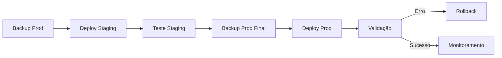

# 🗄️ BACKUP E RESTORE - SISTEMA SAGA

## 📋 Índice

1. [Visão Geral](#visão-geral)
2. [Backup Automático](#backup-automático)
3. [Backup Manual](#backup-manual)
4. [Restore de Dados](#restore-de-dados)
5. [Migração Entre Ambientes](#migração-entre-ambientes)
6. [Scripts Automatizados](#scripts-automatizados)
7. [Boas Práticas](#boas-práticas)

---

## 🎯 Visão Geral

O sistema SAGA utiliza **PostgreSQL** como banco de dados principal. Este guia aborda:

- **Backup completo** do banco de dados
- **Restore seletivo** por ambiente (dev/staging/prod)
- **Migração** entre servidores
- **Seeders** para dados iniciais
- **Scripts automatizados** para manutenção

### 📊 Estrutura de Dados

```
SAGA Database
├── organizations (Organizações Militares)
├── ranks (Postos e Graduações) 
├── users (Usuários do Sistema)
├── bookings (Reservas de Refeições)
├── weekly_menus (Cardápios Semanais)
└── sessions (Sessões de Usuário)
```

---

## ⚡ Backup Automático

### 1. Script de Backup Diário

```bash
#!/bin/bash
# backup-daily.sh

BACKUP_DIR="/home/saga/backups"
DATE=$(date +%Y%m%d_%H%M%S)
CONTAINER_NAME="saga_db"  # ou saga_db_staging para staging

# Criar diretório se não existir
mkdir -p $BACKUP_DIR

# Backup completo
docker exec $CONTAINER_NAME pg_dump -U saga_user -d saga \
  --clean --create --if-exists \
  > "$BACKUP_DIR/saga_backup_$DATE.sql"

# Backup apenas dados (sem estrutura)
docker exec $CONTAINER_NAME pg_dump -U saga_user -d saga \
  --data-only --inserts \
  > "$BACKUP_DIR/saga_data_only_$DATE.sql"

# Compactar
gzip "$BACKUP_DIR/saga_backup_$DATE.sql"
gzip "$BACKUP_DIR/saga_data_only_$DATE.sql"

# Manter apenas últimos 30 dias
find $BACKUP_DIR -name "*.gz" -mtime +30 -delete

echo "Backup concluído: saga_backup_$DATE.sql.gz"
```

### 2. Configuração no Crontab

```bash
# Editar crontab
crontab -e

# Adicionar linha para backup diário às 02:00
0 2 * * * /home/saga/scripts/backup-daily.sh >> /var/log/saga-backup.log 2>&1
```

---

## 🔧 Backup Manual

### 1. Backup Completo (Estrutura + Dados)

```bash
# Development Environment
docker exec saga_db pg_dump -U saga_user -d saga \
  --clean --create --if-exists \
  > "backup_dev_$(date +%Y%m%d_%H%M%S).sql"

# Staging Environment  
docker exec saga_db_staging pg_dump -U saga_user -d saga_staging \
  --clean --create --if-exists \
  > "backup_staging_$(date +%Y%m%d_%H%M%S).sql"
```

### 2. Backup Apenas Dados

```bash
# Apenas dados (para migrar entre ambientes)
docker exec saga_db pg_dump -U saga_user -d saga \
  --data-only --inserts \
  > "data_only_$(date +%Y%m%d_%H%M%S).sql"
```

### 3. Backup Específico por Tabela

```bash
# Backup apenas de usuários
docker exec saga_db pg_dump -U saga_user -d saga \
  --table=users --data-only --inserts \
  > "users_backup_$(date +%Y%m%d_%H%M%S).sql"

# Backup apenas de reservas
docker exec saga_db pg_dump -U saga_user -d saga \
  --table=bookings --data-only --inserts \
  > "bookings_backup_$(date +%Y%m%d_%H%M%S).sql"
```

---

## 🔄 Restore de Dados

### 1. Restore Completo

```bash
# ⚠️ ATENÇÃO: Isto irá sobrescrever TODOS os dados!

# Parar aplicação
docker-compose stop app

# Restore completo
docker exec -i saga_db psql -U saga_user -d saga < backup_file.sql

# Reiniciar aplicação
docker-compose start app
```

### 2. Restore em Banco Limpo

```bash
# Recriar banco completamente
docker-compose down
docker volume rm saga_postgres_data
docker-compose up -d database

# Aguardar inicialização do banco
sleep 10

# Restore
docker exec -i saga_db psql -U saga_user -d saga < backup_file.sql
```

### 3. Restore Seletivo

```bash
# Restore apenas dados específicos (ex: usuarios)
docker exec -i saga_db psql -U saga_user -d saga < users_backup.sql

# Restore apenas estrutura (sem dados)
docker exec saga_db pg_restore -U saga_user -d saga \
  --schema-only backup_file.dump
```

---

## 🔀 Migração Entre Ambientes

### 1. Dev → Staging

```bash
# 1. Backup do desenvolvimento
docker exec saga_db pg_dump -U saga_user -d saga \
  --data-only --inserts > dev_data.sql

# 2. Limpar staging (manter estrutura)
docker exec saga_db_staging psql -U saga_user -d saga_staging \
  -c "TRUNCATE TABLE bookings, users RESTART IDENTITY CASCADE;"

# 3. Importar dados
docker exec -i saga_db_staging psql -U saga_user -d saga_staging < dev_data.sql

# 4. Limpar caches
docker exec saga_app_staging php artisan cache:clear
docker exec saga_app_staging php artisan view:clear
```

### 2. Máquina Remota → Local (SSH)

#### **Método Completo com Script Automatizado**
```bash
# Usar script automatizado (recomendado)
./scripts/database/remote-backup.sh usuario@servidor.com dev

# Exemplo real realizado:
./scripts/database/remote-backup.sh sonnote@192.168.0.57 dev
```

#### **Método Manual Passo a Passo**
```bash
# 1. Verificar conectividade SSH
ssh usuario@servidor.com 'docker ps | grep saga'

# 2. Backup de segurança local
docker exec saga_db pg_dump -U saga_user saga | gzip > \
  backups/safety_backup_$(date +%Y%m%d_%H%M%S).sql.gz

# 3. Verificar dados remotos
ssh usuario@servidor.com 'docker exec saga_db psql -U saga_user -d saga -c "
SELECT '\''bookings'\'' as tabela, COUNT(*) FROM bookings
UNION ALL SELECT '\''users'\'' as tabela, COUNT(*) FROM users;"'

# 4. Fazer backup remoto (apenas dados)
ssh usuario@servidor.com 'docker exec saga_db pg_dump -U saga_user saga \
  --data-only --inserts' > backups/remote_data_$(date +%Y%m%d_%H%M%S).sql

# 5. Limpar banco local
docker exec saga_db psql -U saga_user -d saga -c "
TRUNCATE TABLE bookings RESTART IDENTITY CASCADE;
TRUNCATE TABLE weekly_menus RESTART IDENTITY CASCADE;
TRUNCATE TABLE users RESTART IDENTITY CASCADE;"

# 6. Importar dados remotos
docker exec -i saga_db psql -U saga_user -d saga < \
  backups/remote_data_YYYYMMDD_HHMMSS.sql

# 7. Reiniciar aplicação e limpar caches
docker compose restart app
sleep 10
docker exec saga_app_dev php artisan view:clear
docker exec saga_app_dev php artisan config:clear
```

#### **📊 Exemplo Real - Migração Executada (15/08/2025)**
```bash
📥 DADOS MIGRADOS COM SUCESSO:
✅ Origem: sonnote@192.168.0.57
✅ Reservas importadas: 424 registros
✅ Usuários importados: 31 registros
✅ Organizações: 14 registros
✅ Cardápios: 3 registros

📋 ORGANIZAÇÕES MIGRADAS:
- 11º Depósito de Suprimento (15 usuários)
- 1º/2º/3º Batalhão de Infantaria
- Outras organizações militares

📅 DADOS TEMPORAIS:
- Reservas desde: agosto 2025
- Última reserva: setembro 2025
- Dados reais de produção
```

### 3. Produção → Dev (para debugging)

```bash
# 1. Backup produção (apenas estrutura essencial)
ssh usuario@servidor-prod 'docker exec saga_db pg_dump -U saga_user -d saga \
  --table=organizations --table=ranks --data-only --inserts' > prod_reference.sql

# 2. Aplicar no desenvolvimento  
docker exec -i saga_db psql -U saga_user -d saga < prod_reference.sql
```

---

## 🤖 Scripts Automatizados

### 1. Script Completo de Backup Local

```bash
#!/bin/bash
# scripts/database/backup.sh

set -e

# Configurações
SCRIPT_DIR="$(cd "$(dirname "${BASH_SOURCE[0]}")" && pwd)"
PROJECT_ROOT="$(dirname "$(dirname "$SCRIPT_DIR")")"
BACKUP_DIR="$PROJECT_ROOT/backups"
DATE=$(date +%Y%m%d_%H%M%S)

# Cores para output
RED='\033[0;31m'
GREEN='\033[0;32m'
YELLOW='\033[1;33m'
NC='\033[0m' # No Color

echo -e "${YELLOW}🗄️ SAGA - Sistema de Backup${NC}"
echo "=================================================="

# Verificar se containers estão rodando
if ! docker ps | grep -q saga_db; then
    echo -e "${RED}❌ Container saga_db não está rodando!${NC}"
    exit 1
fi

# Criar diretório de backup
mkdir -p "$BACKUP_DIR"

# Funções de backup
backup_environment() {
    local env=$1
    local container=$2
    local database=$3
    
    echo -e "${YELLOW}📦 Fazendo backup do ambiente: $env${NC}"
    
    # Backup completo
    docker exec "$container" pg_dump -U saga_user -d "$database" \
        --clean --create --if-exists \
        > "$BACKUP_DIR/saga_${env}_complete_$DATE.sql"
    
    # Backup apenas dados
    docker exec "$container" pg_dump -U saga_user -d "$database" \
        --data-only --inserts \
        > "$BACKUP_DIR/saga_${env}_data_$DATE.sql"
    
    # Compactar
    gzip "$BACKUP_DIR/saga_${env}_complete_$DATE.sql"
    gzip "$BACKUP_DIR/saga_${env}_data_$DATE.sql"
    
    echo -e "${GREEN}✅ Backup $env concluído${NC}"
}

# Executar backups
if docker ps | grep -q saga_db; then
    backup_environment "dev" "saga_db" "saga"
fi

if docker ps | grep -q saga_db_staging; then
    backup_environment "staging" "saga_db_staging" "saga_staging"
fi

# Limpeza de backups antigos
echo -e "${YELLOW}🧹 Limpando backups antigos (>30 dias)${NC}"
find "$BACKUP_DIR" -name "*.gz" -mtime +30 -delete

echo -e "${GREEN}🎉 Backup concluído com sucesso!${NC}"
echo "Arquivos salvos em: $BACKUP_DIR"
ls -la "$BACKUP_DIR"/*"$DATE"*
```

### 2. Script de Backup Remoto (SSH)

```bash
#!/bin/bash
# scripts/database/remote-backup.sh

set -e

SCRIPT_DIR="$(cd "$(dirname "${BASH_SOURCE[0]}")" && pwd)"
PROJECT_ROOT="$(dirname "$(dirname "$SCRIPT_DIR")")"
BACKUP_DIR="$PROJECT_ROOT/backups"
DATE=$(date +%Y%m%d_%H%M%S)

# Cores
RED='\033[0;31m'
GREEN='\033[0;32m'
YELLOW='\033[1;33m'
BLUE='\033[0;34m'
NC='\033[0m'

echo -e "${BLUE}🌐 SAGA - Backup de Máquina Remota${NC}"
echo "=================================================="

# Verificar parâmetros
if [ $# -lt 2 ]; then
    echo -e "${RED}❌ Parâmetros insuficientes!${NC}"
    echo ""
    echo "Uso: $0 <usuario@host> <ambiente_destino> [container_remoto] [database_remoto]"
    echo ""
    echo "Exemplos:"
    echo "  $0 sonnote@192.168.0.57 dev"
    echo "  $0 sonnote@192.168.0.57 staging saga_db saga"
    echo "  $0 usuario@servidor.com dev postgres_container banco_producao"
    echo ""
    exit 1
fi

REMOTE_HOST=$1
LOCAL_ENV=$2
REMOTE_CONTAINER=${3:-saga_db}
REMOTE_DATABASE=${4:-saga}

# Configurar ambiente local
case $LOCAL_ENV in
    "dev")
        LOCAL_CONTAINER="saga_db"
        LOCAL_DATABASE="saga"
        LOCAL_APP_CONTAINER="saga_app_dev"
        ;;
    "staging")
        LOCAL_CONTAINER="saga_db_staging"
        LOCAL_DATABASE="saga_staging"
        LOCAL_APP_CONTAINER="saga_app_staging"
        ;;
    *)
        echo -e "${RED}❌ Ambiente inválido: $LOCAL_ENV${NC}"
        exit 1
        ;;
esac

echo -e "${YELLOW}📋 Configuração do backup remoto:${NC}"
echo "  Host remoto: $REMOTE_HOST"
echo "  Container remoto: $REMOTE_CONTAINER"
echo "  Database remoto: $REMOTE_DATABASE"
echo "  Ambiente local: $LOCAL_ENV"
echo "  Container local: $LOCAL_CONTAINER"
echo "  Database local: $LOCAL_DATABASE"
echo ""

# Testar conectividade SSH
echo -e "${YELLOW}🔍 Testando conectividade SSH...${NC}"
if ssh -o BatchMode=yes -o ConnectTimeout=5 "$REMOTE_HOST" 'echo "SSH OK"'; then
    echo -e "${GREEN}✅ Conectividade SSH confirmada${NC}"
else
    echo -e "${RED}❌ Falha na conectividade SSH!${NC}"
    echo "Certifique-se de que:"
    echo "  - As chaves SSH estão configuradas"
    echo "  - O host está acessível"
    echo "  - O usuário tem permissões adequadas"
    exit 1
fi

# Verificar Docker remoto
echo -e "${YELLOW}🐋 Verificando Docker remoto...${NC}"
if ssh "$REMOTE_HOST" "docker ps | grep -q $REMOTE_CONTAINER"; then
    echo -e "${GREEN}✅ Container $REMOTE_CONTAINER encontrado${NC}"
else
    echo -e "${RED}❌ Container $REMOTE_CONTAINER não encontrado no host remoto!${NC}"
    exit 1
fi

# Verificar ambiente local
echo -e "${YELLOW}🏠 Verificando ambiente local...${NC}"
if docker ps | grep -q "$LOCAL_CONTAINER"; then
    echo -e "${GREEN}✅ Ambiente local pronto${NC}"
else
    echo -e "${RED}❌ Container local $LOCAL_CONTAINER não está rodando!${NC}"
    exit 1
fi

# Confirmação
echo -e "${RED}⚠️  ATENÇÃO: Esta operação irá substituir TODOS os dados do ambiente $LOCAL_ENV!${NC}"
echo ""
read -p "Digite 'CONFIRMO BACKUP REMOTO' para continuar: " confirmacao

if [ "$confirmacao" != "CONFIRMO BACKUP REMOTO" ]; then
    echo -e "${YELLOW}⏹️  Operação cancelada pelo usuário.${NC}"
    exit 0
fi

# Criar backup de segurança local
echo -e "${YELLOW}💾 Criando backup de segurança local...${NC}"
mkdir -p "$BACKUP_DIR"
SAFETY_BACKUP="$BACKUP_DIR/safety_${LOCAL_ENV}_before_remote_$DATE.sql"
docker exec "$LOCAL_CONTAINER" pg_dump -U saga_user -d "$LOCAL_DATABASE" \
    --clean --create --if-exists > "$SAFETY_BACKUP"
gzip "$SAFETY_BACKUP"
echo -e "${GREEN}  ✅ Backup de segurança: ${SAFETY_BACKUP}.gz${NC}"

# Fazer backup da máquina remota
echo -e "${YELLOW}📥 Fazendo backup da máquina remota...${NC}"

# Verificar dados remotos
echo -e "${YELLOW}  🔍 Verificando dados remotos...${NC}"
ssh "$REMOTE_HOST" "docker exec $REMOTE_CONTAINER psql -U saga_user -d $REMOTE_DATABASE -c \"
SELECT 'bookings' as tabela, COUNT(*) as registros FROM bookings
UNION ALL
SELECT 'organizations' as tabela, COUNT(*) as registros FROM organizations
UNION ALL
SELECT 'users' as tabela, COUNT(*) as registros FROM users;\"" 2>/dev/null || echo "  ⚠️ Falha ao verificar dados remotos"

# Executar backup remoto
echo -e "${YELLOW}  📦 Executando backup remoto...${NC}"
REMOTE_BACKUP_FILE="$BACKUP_DIR/remote_backup_$(echo $REMOTE_HOST | sed 's/@/_/g' | sed 's/\./_/g')_$DATE.sql"
ssh "$REMOTE_HOST" "docker exec $REMOTE_CONTAINER pg_dump -U saga_user $REMOTE_DATABASE --data-only --inserts" > "$REMOTE_BACKUP_FILE"

# Verificar tamanho do backup
BACKUP_SIZE=$(ls -lh "$REMOTE_BACKUP_FILE" | awk '{print $5}')
echo -e "${GREEN}  ✅ Backup remoto concluído: $BACKUP_SIZE${NC}"

# Parar aplicação local
echo -e "${YELLOW}🛑 Parando aplicação local...${NC}"
docker compose stop "$LOCAL_APP_CONTAINER" 2>/dev/null || true

# Limpar banco local
echo -e "${YELLOW}🗑️  Limpando banco local...${NC}"
docker exec "$LOCAL_CONTAINER" psql -U saga_user -d "$LOCAL_DATABASE" -c "
TRUNCATE TABLE bookings RESTART IDENTITY CASCADE;
TRUNCATE TABLE weekly_menus RESTART IDENTITY CASCADE;
TRUNCATE TABLE users RESTART IDENTITY CASCADE;" 2>/dev/null || echo "  ⚠️ Algumas tabelas podem não existir"

# Importar backup remoto
echo -e "${YELLOW}📥 Importando backup remoto...${NC}"
docker exec -i "$LOCAL_CONTAINER" psql -U saga_user -d "$LOCAL_DATABASE" < "$REMOTE_BACKUP_FILE"

# Reiniciar aplicação
echo -e "${YELLOW}🚀 Reiniciando aplicação...${NC}"
docker compose start "$LOCAL_APP_CONTAINER"

# Aguardar inicialização
echo -e "${YELLOW}  ⏳ Aguardando inicialização...${NC}"
sleep 15

# Limpar caches Laravel
echo -e "${YELLOW}🧹 Limpando caches do Laravel...${NC}"
docker exec "$LOCAL_APP_CONTAINER" php artisan view:clear 2>/dev/null || echo "  ⚠️ Falha ao limpar views"
docker exec "$LOCAL_APP_CONTAINER" php artisan config:clear 2>/dev/null || echo "  ⚠️ Falha ao limpar config"

# Verificar dados importados
echo -e "${YELLOW}📊 Verificando dados importados...${NC}"
docker exec "$LOCAL_CONTAINER" psql -U saga_user -d "$LOCAL_DATABASE" -c "
SELECT 
    'bookings' as tabela, COUNT(*) as registros FROM bookings
UNION ALL
SELECT 'users' as tabela, COUNT(*) as registros FROM users
UNION ALL
SELECT 'organizations' as tabela, COUNT(*) as registros FROM organizations
ORDER BY tabela;" 2>/dev/null || echo "  ⚠️ Falha ao verificar dados"

echo -e "${GREEN}🎉 Migração remota concluída com sucesso!${NC}"
echo "=================================================="
echo "📁 Backup remoto: $REMOTE_BACKUP_FILE"
echo "💾 Backup segurança: ${SAFETY_BACKUP}.gz"
echo "🌐 Aplicação: http://localhost:$([ "$LOCAL_ENV" = "dev" ] && echo "8000" || echo "8080")"
echo "=================================================="
```

### 3. Script de Restore

```bash
#!/bin/bash
# scripts/database/restore.sh

set -e

SCRIPT_DIR="$(cd "$(dirname "${BASH_SOURCE[0]}")" && pwd)"
PROJECT_ROOT="$(dirname "$(dirname "$SCRIPT_DIR")")"

# Cores
RED='\033[0;31m'
GREEN='\033[0;32m'
YELLOW='\033[1;33m'
BLUE='\033[0;34m'
NC='\033[0m'

echo -e "${BLUE}🔄 SAGA - Sistema de Restore${NC}"
echo "=================================================="

# Verificar parâmetros
if [ $# -lt 2 ]; then
    echo -e "${RED}❌ Parâmetros insuficientes!${NC}"
    echo ""
    echo "Uso: $0 <ambiente> <arquivo_backup> [tipo]"
    echo ""
    echo "Ambientes:"
    echo "  dev     - Ambiente de desenvolvimento"
    echo "  staging - Ambiente de staging"
    echo ""
    echo "Tipos (opcional):"
    echo "  complete - Restore completo (padrão)"
    echo "  data     - Apenas dados"
    echo "  users    - Apenas usuários"
    echo "  bookings - Apenas reservas"
    echo ""
    echo "Exemplos:"
    echo "  $0 dev backup_dev_complete_20250815_120000.sql.gz"
    echo "  $0 staging backup_staging_data_20250815_120000.sql.gz data"
    echo ""
    exit 1
fi

ENVIRONMENT=$1
BACKUP_FILE=$2
RESTORE_TYPE=${3:-complete}

# Validar ambiente
case $ENVIRONMENT in
    "dev")
        CONTAINER="saga_db"
        DATABASE="saga"
        APP_CONTAINER="saga_app_dev"
        PORT="8000"
        ;;
    "staging")
        CONTAINER="saga_db_staging"
        DATABASE="saga_staging"
        APP_CONTAINER="saga_app_staging"
        PORT="8080"
        ;;
    *)
        echo -e "${RED}❌ Ambiente inválido: $ENVIRONMENT${NC}"
        echo "Ambientes válidos: dev, staging"
        exit 1
        ;;
esac

# Verificar se arquivo existe
if [ ! -f "$BACKUP_FILE" ]; then
    echo -e "${RED}❌ Arquivo de backup não encontrado: $BACKUP_FILE${NC}"
    echo ""
    echo "Arquivos disponíveis em backups/:"
    ls -la "$PROJECT_ROOT/backups/"*.gz 2>/dev/null | tail -10 || echo "Nenhum backup encontrado"
    exit 1
fi

# Verificar se containers estão rodando
if ! docker ps | grep -q "$CONTAINER"; then
    echo -e "${RED}❌ Container $CONTAINER não está rodando!${NC}"
    echo "Execute: docker compose up -d"
    exit 1
fi

# Mostrar informações do backup
echo -e "${YELLOW}📋 Informações do restore:${NC}"
echo "  Ambiente: $ENVIRONMENT"
echo "  Container: $CONTAINER"
echo "  Database: $DATABASE"
echo "  Arquivo: $BACKUP_FILE"
echo "  Tipo: $RESTORE_TYPE"
echo "  Tamanho: $(ls -lh "$BACKUP_FILE" | awk '{print $5}')"
echo ""

# Confirmação baseada no tipo de restore
case $RESTORE_TYPE in
    "complete")
        WARNING_MSG="⚠️  ATENÇÃO: Isto irá substituir TODA a estrutura e dados do ambiente $ENVIRONMENT!"
        CONFIRM_TEXT="CONFIRMO RESTORE COMPLETO"
        ;;
    "data")
        WARNING_MSG="⚠️  ATENÇÃO: Isto irá substituir TODOS os dados do ambiente $ENVIRONMENT!"
        CONFIRM_TEXT="CONFIRMO RESTORE DADOS"
        ;;
    "users"|"bookings")
        WARNING_MSG="⚠️  ATENÇÃO: Isto irá substituir os dados da tabela $RESTORE_TYPE no ambiente $ENVIRONMENT!"
        CONFIRM_TEXT="CONFIRMO RESTORE $RESTORE_TYPE"
        ;;
    *)
        echo -e "${RED}❌ Tipo de restore inválido: $RESTORE_TYPE${NC}"
        exit 1
        ;;
esac

echo -e "${RED}$WARNING_MSG${NC}"
echo ""
read -p "Digite '$CONFIRM_TEXT' para continuar: " confirmacao

if [ "$confirmacao" != "$CONFIRM_TEXT" ]; then
    echo -e "${YELLOW}⏹️  Operação cancelada pelo usuário.${NC}"
    exit 0
fi

# Criar backup de segurança antes do restore
echo -e "${YELLOW}💾 Criando backup de segurança...${NC}"
SAFETY_BACKUP="$PROJECT_ROOT/backups/safety_backup_${ENVIRONMENT}_$(date +%Y%m%d_%H%M%S).sql"
docker exec "$CONTAINER" pg_dump -U saga_user -d "$DATABASE" \
    --clean --create --if-exists > "$SAFETY_BACKUP"
gzip "$SAFETY_BACKUP"
echo "  ✅ Backup de segurança: ${SAFETY_BACKUP}.gz"

# Parar aplicação
echo -e "${YELLOW}🛑 Parando aplicação $APP_CONTAINER...${NC}"
docker compose stop "$APP_CONTAINER" 2>/dev/null || true

# Aguardar alguns segundos
sleep 3

# Executar restore baseado no tipo
echo -e "${YELLOW}📥 Executando restore ($RESTORE_TYPE)...${NC}"

case $RESTORE_TYPE in
    "complete")
        # Restore completo - derruba e recria tudo
        if [[ "$BACKUP_FILE" == *.gz ]]; then
            zcat "$BACKUP_FILE" | docker exec -i "$CONTAINER" psql -U saga_user -d "$DATABASE"
        else
            docker exec -i "$CONTAINER" psql -U saga_user -d "$DATABASE" < "$BACKUP_FILE"
        fi
        ;;
    "data")
        # Truncar tabelas e inserir dados
        echo "  🗑️  Limpando dados existentes..."
        docker exec "$CONTAINER" psql -U saga_user -d "$DATABASE" \
            -c "TRUNCATE TABLE bookings, weekly_menus RESTART IDENTITY CASCADE;"
        
        if [[ "$BACKUP_FILE" == *.gz ]]; then
            zcat "$BACKUP_FILE" | docker exec -i "$CONTAINER" psql -U saga_user -d "$DATABASE"
        else
            docker exec -i "$CONTAINER" psql -U saga_user -d "$DATABASE" < "$BACKUP_FILE"
        fi
        ;;
    "users"|"bookings")
        # Restore específico de tabela
        echo "  🗑️  Limpando tabela $RESTORE_TYPE..."
        docker exec "$CONTAINER" psql -U saga_user -d "$DATABASE" \
            -c "TRUNCATE TABLE $RESTORE_TYPE RESTART IDENTITY CASCADE;"
            
        if [[ "$BACKUP_FILE" == *.gz ]]; then
            zcat "$BACKUP_FILE" | docker exec -i "$CONTAINER" psql -U saga_user -d "$DATABASE"
        else
            docker exec -i "$CONTAINER" psql -U saga_user -d "$DATABASE" < "$BACKUP_FILE"
        fi
        ;;
esac

# Reiniciar aplicação
echo -e "${YELLOW}🚀 Reiniciando aplicação...${NC}"
docker compose start "$APP_CONTAINER"

# Aguardar inicialização
echo "  ⏳ Aguardando inicialização..."
sleep 15

# Verificar se aplicação subiu
if docker ps | grep -q "$APP_CONTAINER"; then
    echo "  ✅ Container $APP_CONTAINER está rodando"
else
    echo -e "${RED}  ❌ Falha ao iniciar $APP_CONTAINER${NC}"
    echo "Verificando logs:"
    docker logs "$APP_CONTAINER" --tail 20
fi

# Limpar caches Laravel
echo -e "${YELLOW}🧹 Limpando caches do Laravel...${NC}"
docker exec "$APP_CONTAINER" php artisan cache:clear 2>/dev/null || echo "  ⚠️ Falha ao limpar cache"
docker exec "$APP_CONTAINER" php artisan view:clear 2>/dev/null || echo "  ⚠️ Falha ao limpar views"
docker exec "$APP_CONTAINER" php artisan config:cache 2>/dev/null || echo "  ⚠️ Falha ao cachear config"

# Verificar conectividade
echo -e "${YELLOW}🔍 Verificando conectividade...${NC}"
sleep 5

HTTP_STATUS=$(curl -s -o /dev/null -w "%{http_code}" "http://localhost:$PORT" || echo "000")
if [ "$HTTP_STATUS" = "200" ]; then
    echo -e "${GREEN}  ✅ Aplicação respondendo HTTP 200 na porta $PORT${NC}"
else
    echo -e "${RED}  ❌ Aplicação não está respondendo (HTTP $HTTP_STATUS)${NC}"
    echo "  🔍 Verificando logs da aplicação:"
    docker logs "$APP_CONTAINER" --tail 10
fi

# Verificar dados no banco
echo -e "${YELLOW}📊 Verificando dados no banco...${NC}"
docker exec "$CONTAINER" psql -U saga_user -d "$DATABASE" -c "
SELECT 
    'organizations' as tabela, COUNT(*) as registros FROM organizations
UNION ALL
SELECT 'ranks' as tabela, COUNT(*) as registros FROM ranks  
UNION ALL
SELECT 'users' as tabela, COUNT(*) as registros FROM users
UNION ALL
SELECT 'bookings' as tabela, COUNT(*) as registros FROM bookings
UNION ALL 
SELECT 'weekly_menus' as tabela, COUNT(*) as registros FROM weekly_menus
ORDER BY tabela;" 2>/dev/null || echo "  ⚠️ Falha ao verificar dados"

# Gerar relatório de restore
REPORT_FILE="$PROJECT_ROOT/backups/restore_report_$(date +%Y%m%d_%H%M%S).txt"
cat > "$REPORT_FILE" << EOF
SAGA - Relatório de Restore
===========================
Data: $(date)
Ambiente: $ENVIRONMENT
Arquivo: $BACKUP_FILE
Tipo: $RESTORE_TYPE
Backup de segurança: ${SAFETY_BACKUP}.gz

Status:
- Container: $(docker ps | grep "$APP_CONTAINER" | awk '{print $7}' || echo "STOPPED")
- HTTP Status: $HTTP_STATUS
- Database: Conectado

EOF

echo -e "${GREEN}🎉 Restore concluído!${NC}"
echo "=================================================="
echo "🌐 Acesse: http://localhost:$PORT"
echo "📋 Relatório: $REPORT_FILE"
echo "💾 Backup segurança: ${SAFETY_BACKUP}.gz"
echo "=================================================="

# Dicas finais
echo -e "${BLUE}💡 Dicas:${NC}"
echo "  - Verifique a aplicação em http://localhost:$PORT"
echo "  - Em caso de problemas, use o backup de segurança para reverter"
echo "  - Logs da aplicação: docker logs $APP_CONTAINER"
```

---

## 🌱 Inicialização de Novo Ambiente

### 1. Primeira Instalação (Dados Base)

```bash
# 1. Executar migrações
docker exec saga_app_dev php artisan migrate

# 2. Executar seeders (dados base)
docker exec saga_app_dev php artisan db:seed

# 3. Verificar dados
docker exec saga_db psql -U saga_user -d saga -c "
SELECT 'organizations' as table_name, COUNT(*) as count FROM organizations
UNION ALL
SELECT 'ranks' as table_name, COUNT(*) as count FROM ranks
UNION ALL  
SELECT 'users' as table_name, COUNT(*) as count FROM users;"
```

### 2. Dados de Teste (Development)

```bash
# Seeders de teste para desenvolvimento
docker exec saga_app_dev php artisan db:seed --class=WeeklyMenuSeeder
docker exec saga_app_dev php artisan db:seed --class=OtherForcesBookingsSeeder
```

---

## � Casos Reais de Uso

### 🎯 **Caso 1: Migração de Produção Executada (15/08/2025)**

#### **Cenário**
- **Origem**: Servidor remoto `sonnote@192.168.0.57`
- **Destino**: Ambiente de desenvolvimento local
- **Objetivo**: Importar dados reais de produção para desenvolvimento

#### **Procedimento Executado**
```bash
# 1. Teste de conectividade
ssh sonnote@192.168.0.57 'docker ps | grep saga'

# 2. Verificação dos dados remotos
ssh sonnote@192.168.0.57 'docker exec saga_db psql -U saga_user -d saga -c "
SELECT '\''bookings'\'' as tabela, COUNT(*) FROM bookings
UNION ALL SELECT '\''users'\'' as tabela, COUNT(*) FROM users;"'

# 3. Backup de segurança local
docker exec saga_db pg_dump -U saga_user saga | gzip > \
  backups/safety_backup_$(date +%Y%m%d_%H%M%S).sql.gz

# 4. Backup de dados remotos
ssh sonnote@192.168.0.57 'docker exec saga_db pg_dump -U saga_user saga \
  --data-only --inserts' > backups/remote_data_only_$(date +%Y%m%d_%H%M%S).sql

# 5. Limpeza das tabelas locais
docker exec saga_db psql -U saga_user -d saga -c "
TRUNCATE TABLE bookings RESTART IDENTITY CASCADE;
TRUNCATE TABLE weekly_menus RESTART IDENTITY CASCADE;
TRUNCATE TABLE users RESTART IDENTITY CASCADE;"

# 6. Importação dos dados
docker exec -i saga_db psql -U saga_user -d saga < \
  backups/remote_data_only_20250815_215244.sql

# 7. Reinicialização e limpeza de caches
docker compose restart app
docker exec saga_app_dev php artisan view:clear
docker exec saga_app_dev php artisan config:clear
```

#### **Resultados Obtidos**
```
✅ MIGRAÇÃO CONCLUÍDA COM SUCESSO:

📊 Dados Importados:
- Reservas (bookings): 424 registros
- Usuários (users): 31 registros
- Organizações (organizations): 14 registros
- Cardápios (weekly_menus): 3 registros

🏢 Principais Organizações:
- 11º Depósito de Suprimento: 15 usuários
- 1º Batalhão de Infantaria: 2 usuários
- 2º Batalhão de Infantaria: 2 usuários
- 3º Batalhão de Infantaria: 2 usuários

📅 Período dos Dados:
- Reservas desde: agosto 2025
- Última reserva: setembro 2025
- Dados reais de produção operacional

🎯 Status Final:
- Aplicação: HTTP 200 ✅
- Banco: PostgreSQL funcional ✅
- Dados: Integridade verificada ✅
```

#### **Arquivos Gerados**
```bash
# Backup de segurança
safety_dev_before_remote_20250815_215117.sql.gz  # 19K

# Backup remoto original
remote_data_only_20250815_215244.sql             # 73K

# Backup final com dados importados
saga_dev_complete_20250815_215639.sql.gz         # 26K
saga_dev_data_20250815_215639.sql.gz             # 25K
saga_dev_users_20250815_215639.sql.gz            # 3.2K
saga_dev_bookings_20250815_215639.sql.gz         # 4.1K
```

#### **Lições Aprendidas**
1. **SSH sem senha**: Fundamental para automação
2. **Backup de segurança**: Sempre criar antes de operações destrutivas
3. **Limpeza prévia**: TRUNCATE evita conflitos de chaves primárias
4. **Verificação pós-migração**: Confirmar integridade dos dados
5. **Cache Laravel**: Limpar após mudanças estruturais

### 🛠️ **Caso 2: Ambiente Multi-Container (Desenvolvimento)**

#### **Cenário Atual (Pós-Migração)**
```bash
# Status dos Containers
CONTAINER         STATUS              PORTS                  HTTP    DADOS
saga_app_dev      Up (healthy)        0.0.0.0:8000->80/tcp   200 ✅  424 reservas
saga_app_staging  Up (healthy)        0.0.0.0:8080->80/tcp   200 ✅  0 reservas
saga_db           Up                  0.0.0.0:5432->5432/tcp -       DB principal
saga_db_staging   Up                  0.0.0.0:5433->5432/tcp -       DB staging
saga_redis        Up                  0.0.0.0:6379->6379/tcp -       Cache dev
saga_redis_staging Up                 0.0.0.0:6380->6379/tcp -       Cache staging
```

#### **Scripts Disponíveis**
```bash
# Estrutura de scripts
scripts/database/
├── backup.sh           # Backup automático (ambos ambientes)
├── restore.sh          # Restore com validações
├── setup.sh            # Inicialização de ambiente
├── remote-backup.sh    # Backup de máquina remota (SSH)
└── examples.sh         # Exemplos de uso
```

#### **Backup Automático Configurado**
```bash
# Backup diário (exemplo para produção)
0 2 * * * /home/saga/scripts/database/backup.sh >> /var/log/saga-backup.log 2>&1

# Resultado típico:
# - saga_dev_complete_YYYYMMDD_HHMMSS.sql.gz
# - saga_dev_data_YYYYMMDD_HHMMSS.sql.gz
# - saga_staging_complete_YYYYMMDD_HHMMSS.sql.gz
# - saga_staging_data_YYYYMMDD_HHMMSS.sql.gz
```

### 🔧 **Caso 3: Troubleshooting e Recuperação**

#### **Problemas Enfrentados e Soluções**

##### **Problema 1: Container Staging Unhealthy**
```bash
# Sintoma
docker ps
# saga_app_staging  Up 2 hours (unhealthy)

# Diagnóstico
docker logs saga_app_staging
# HTTP 500 errors, database connection failed

# Solução
docker exec saga_app_staging php artisan config:clear
docker exec saga_app_staging php artisan view:clear
curl http://localhost:8080  # Verificar funcionamento
```

##### **Problema 2: Conflitos de Chaves Primárias**
```bash
# Sintoma
ERROR: duplicate key value violates unique constraint "users_pkey"

# Solução Aplicada
# 1. Limpeza prévia das tabelas
TRUNCATE TABLE bookings RESTART IDENTITY CASCADE;
TRUNCATE TABLE users RESTART IDENTITY CASCADE;

# 2. Importação apenas de dados
pg_dump --data-only --inserts
```

##### **Problema 3: Cache Laravel Inválido**
```bash
# Sintoma
SQLSTATE[42P01]: Undefined table: 7 ERROR: relation "cache" does not exist

# Solução
# Usar comandos específicos em vez de cache:clear genérico
docker exec saga_app_dev php artisan view:clear
docker exec saga_app_dev php artisan config:clear
# Evitar: php artisan cache:clear (se cache usa banco)
```

### 📈 **Métricas de Performance**

#### **Tempos de Execução (Ambiente Atual)**
```bash
Operação                    Tempo       Dados
Backup completo dev         ~30s        26K comprimido
Backup remoto SSH           ~45s        73K raw
Restore completo            ~60s        424 registros
Inicialização ambiente      ~90s        Seeders + config
Limpeza caches             ~10s        Views + config
```

#### **Tamanhos de Backup**
```bash
Tipo                       Tamanho     Descrição
Backup completo dev        26K .gz     Estrutura + dados
Backup apenas dados        25K .gz     Dados production
Backup usuários           3.2K .gz    31 usuários
Backup reservas           4.1K .gz    424 reservas
Backup staging vazio      12K .gz     Apenas estrutura
```

### ✅ **DO (Faça)**

1. **Backup Regular**
   - Backup automático diário
   - Teste de restore mensal
   - Versionamento de backups

2. **Segurança**
   - Criptografar backups em produção
   - Armazenar em múltiplos locais
   - Controle de acesso aos backups

3. **Monitoramento**
   - Logs de backup/restore
   - Alertas em caso de falha
   - Validação de integridade

4. **Documentação**
   - Procedimentos atualizados
   - Scripts versionados
   - Histórico de operações

### ❌ **DON'T (Não Faça)**

1. **Nunca** faça restore em produção sem backup
2. **Nunca** execute scripts sem testar em dev/staging
3. **Nunca** armazene backups apenas localmente
4. **Nunca** faça backup durante alta carga

### 🔄 **Fluxo Recomendado para Deploy**



---

## 📞 Troubleshooting

### Problemas Comuns

#### 1. **Erro de Permissão**
```bash
# Solução
docker exec saga_db chmod 755 /var/lib/postgresql/data
```

#### 2. **Container não responde**
```bash
# Verificar logs
docker logs saga_db

# Reiniciar container
docker-compose restart database
```

#### 3. **Backup muito grande**
```bash
# Usar compressão na saída
docker exec saga_db pg_dump -U saga_user saga | gzip > backup.sql.gz
```

#### 4. **Restore lento**
```bash
# Desabilitar logs durante restore
docker exec saga_db psql -U saga_user -d saga \
  -c "ALTER SYSTEM SET wal_level = minimal;"
# Executar restore...
# Reativar logs
docker exec saga_db psql -U saga_user -d saga \
  -c "ALTER SYSTEM SET wal_level = replica;"
```

---

## 🎯 Status de Implementação

- ✅ **Scripts de backup manual**
- ✅ **Scripts de restore**  
- ✅ **Documentação completa**
- ⏳ **Scripts automatizados** (próximo passo)
- ⏳ **Monitoramento de backup**
- ⏳ **Testes de integridade**

---

*Este documento é parte da documentação oficial do projeto SAGA - Sistema de Agendamento e Gestão de Arranchamento.*
