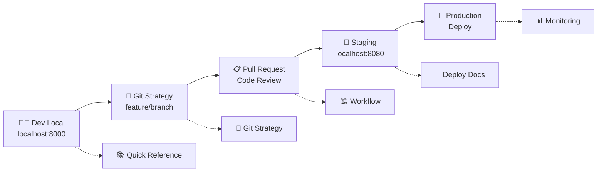

# SAGA - Índice da Documentação
# Guia completo de toda a documentação do projeto

## 📚 DOCUMENTAÇÃO PRINCIPAL

### 🚀 Para Desenvolvedores
| Documento | Descrição | Uso |
|-----------|-----------|-----|
| **[Workflow de Desenvolvimento](DESENVOLVIMENTO_WORKFLOW.md)** | Guia completo de desenvolvimento multi-arquitetura | Desenvolvimento diário |
| **[Quick Reference](QUICK_REFERENCE.md)** | Comandos e referência rápida | Consulta rápida |
| **[Estratégia Git](GIT_STRATEGY.md)** | Branches, commits e Pull Requests | Organização do código |

### 🏗️ Arquitetura e Deploy
| Documento | Descrição | Uso |
|-----------|-----------|-----|
| **[Histórico Multi-Arch](IMPLEMENTACAO_MULTI_ARCH_HISTORY.md)** | Histórico completo da implementação | Entender a arquitetura |
| **[Deploy](DEPLOY.md)** | Instruções de deploy em produção | Deploy e manutenção |
| **[Multi-Arch Quick Reference](MULTI_ARCH_QUICK_REFERENCE.md)** | Referência rápida multi-arquitetura | Build e deploy |

### 📊 Base de Dados e Comandos
| Documento | Descrição | Uso |
|-----------|-----------|-----|
| **[Database Schema](database-schema.md)** | Esquema da base de dados | Entender estrutura |
| **[Database Mermaid](database-mermaid.md)** | Diagramas da base de dados | Visualização |
| **[Comandos](COMMANDS.md)** | Lista de comandos úteis | Operações do sistema |

### 🎯 Outros
| Documento | Descrição | Uso |
|-----------|-----------|-----|
| **[Automação](AUTOMATION_README.md)** | Scripts de automação | Tarefas automatizadas |
| **[Implementação Perfil](IMPLEMENTACAO_PERFIL.md)** | Detalhes do sistema de perfis | Funcionalidade específica |
| **[Deadline Validação](DEADLINE_VALIDACAO.md)** | Prazos e validações | Planejamento |

## 🎯 GUIA DE USO POR CENÁRIO

### 👨‍💻 **Novo Desenvolvedor**
1. Leia: **[README.md](../README.md)** (visão geral)
2. Configure: **[Workflow de Desenvolvimento](DESENVOLVIMENTO_WORKFLOW.md)** (ambiente)
3. Consulte: **[Quick Reference](QUICK_REFERENCE.md)** (comandos diários)
4. Siga: **[Estratégia Git](GIT_STRATEGY.md)** (organização)

### 🔧 **DevOps/SRE**
1. Entenda: **[Histórico Multi-Arch](IMPLEMENTACAO_MULTI_ARCH_HISTORY.md)** (arquitetura)
2. Configure: **[Deploy](DEPLOY.md)** (produção)
3. Use: **[Multi-Arch Quick Reference](MULTI_ARCH_QUICK_REFERENCE.md)** (build)
4. Monitore: **[Comandos](COMMANDS.md)** (operações)

### 🧪 **QA/Tester**
1. Ambiente: **[Workflow de Desenvolvimento](DESENVOLVIMENTO_WORKFLOW.md)** (staging)
2. Dados: **[Database Schema](database-schema.md)** (estrutura)
3. Comandos: **[Quick Reference](QUICK_REFERENCE.md)** (testing)

### 📋 **Gerente de Projeto**
1. Status: **[Histórico Multi-Arch](IMPLEMENTACAO_MULTI_ARCH_HISTORY.md)** (progresso)
2. Prazos: **[Deadline Validação](DEADLINE_VALIDACAO.md)** (timeline)
3. Automação: **[Automação](AUTOMATION_README.md)** (processos)

## 🔄 FLUXO DE DESENVOLVIMENTO RESUMIDO



## 📊 ESTRUTURA MULTI-ARQUITETURA

```
┌─────────────────┬──────────────────┬─────────────────┐
│   DEVELOPMENT   │     STAGING      │   PRODUCTION    │
├─────────────────┼──────────────────┼─────────────────┤
│ localhost:8000  │ localhost:8080   │ porta 80        │
│ .env            │ .env.staging     │ .env.production │
│ Hot reload ✅   │ QA testing ✅    │ Optimized ✅    │
│ Debug ✅        │ Debug ✅         │ Debug ❌        │
│ Mount code ✅   │ Mount + config   │ Embedded ✅     │
└─────────────────┴──────────────────┴─────────────────┘
```

## 🛠️ COMANDOS ESSENCIAIS

### Desenvolvimento
```bash
# Iniciar ambiente
docker compose up -d

# Novo feature
git checkout -b feature/nova-funcionalidade

# Verificar saúde
curl http://localhost:8000  # Dev
curl http://localhost:8080  # Staging
```

### Deploy
```bash
# Build multi-arch
./scripts/deployment/build-multiarch.sh

# Deploy produção
cd deploy/production && ./deploy-production.sh deploy

# Status
docker ps | grep saga
```

## 📋 CHECKLIST DE QUALIDADE

### ✅ Antes do Commit
- [ ] Código testado localmente
- [ ] Mensagem de commit seguindo padrão
- [ ] Sem credenciais hardcoded
- [ ] Formatação aplicada

### ✅ Antes do Deploy Staging
- [ ] Pull Request aprovado
- [ ] Testes passando
- [ ] Documentação atualizada
- [ ] Staging funcionando

### ✅ Antes do Deploy Produção
- [ ] Staging 100% validado
- [ ] Backup realizado
- [ ] Rollback preparado
- [ ] Monitoramento ativo

## 🎯 BENEFÍCIOS DA DOCUMENTAÇÃO

### 📚 **Documentação Completa**
- ✅ Todos os aspectos cobertos
- ✅ Diferentes níveis de detalhamento
- ✅ Exemplos práticos
- ✅ Troubleshooting incluído

### 🚀 **Produtividade**
- ✅ Onboarding rápido de novos devs
- ✅ Referência rápida disponível
- ✅ Processos padronizados
- ✅ Menos tempo em dúvidas

### 🛡️ **Qualidade**
- ✅ Padrões definidos
- ✅ Boas práticas documentadas
- ✅ Workflows testados
- ✅ Segurança considerada

### 👥 **Colaboração**
- ✅ Processo claro para toda equipe
- ✅ Comunicação melhorada
- ✅ Conhecimento compartilhado
- ✅ Redução de conflitos

---

📝 **Última atualização**: 15 de Agosto de 2025  
🎯 **Status**: Documentação completa e atualizada  
🚀 **Próximos passos**: Seguir workflow estabelecido para desenvolvimento
