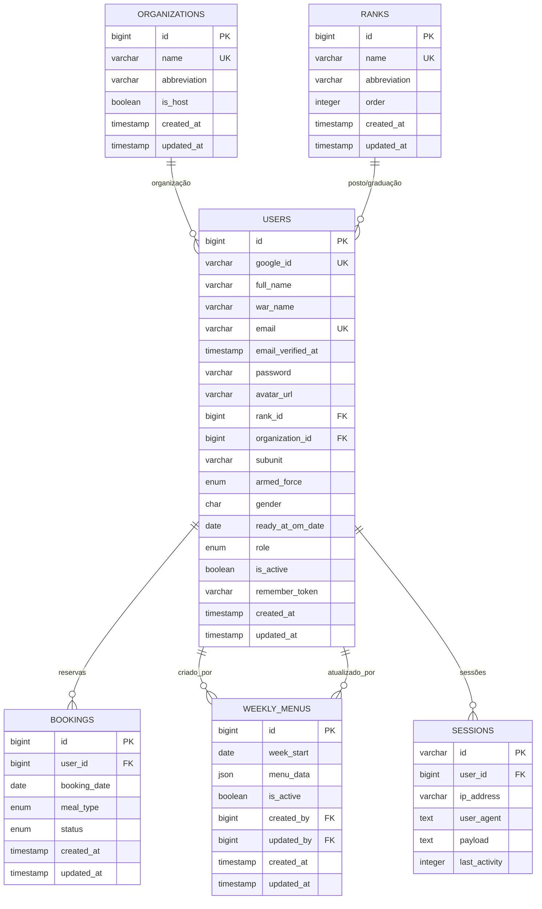

## Modelo de Dados Detalhado - SAGA

### 📊 Estatísticas do Schema
- **6 Tabelas Principais**
- **5 Foreign Keys**
- **4 Unique Constraints**
- **3 Composite Indexes**
- **Múltiplos Enums para Validação**

### 🏗️ Arquitetura do Sistema

#### 1. **Módulo de Autenticação e Usuários**
```
USERS (Tabela Central)
├── Autenticação Híbrida (Google OAuth + Tradicional)
├── Perfil Militar Completo
├── Hierarquia de Permissões
└── Dados Pessoais e Funcionais
```

#### 2. **Módulo Organizacional**
```
ORGANIZATIONS + RANKS
├── Estrutura Militar
├── Hierarquia de Comando
├── Subunidades (SU)
└── Forças Armadas (EB/MB/FAB)
```

#### 3. **Sistema de Reservas**
```
BOOKINGS
├── Controle por Data/Refeição
├── Status de Confirmação
├── Restrições de Unicidade
└── Auditoria Temporal
```

#### 4. **Gestão de Cardápios**
```
WEEKLY_MENUS
├── Estrutura Semanal
├── Dados JSON Flexíveis
├── Controle de Versões
└── Sistema de Ativação
```

### 🔍 Queries Comuns Otimizadas

#### Booking por Usuário e Data
```sql
SELECT b.*, u.war_name, u.full_name 
FROM bookings b 
JOIN users u ON b.user_id = u.id 
WHERE b.booking_date = '2025-08-08' 
  AND b.meal_type = 'lunch'
  AND b.status = 'confirmed';
```

#### Usuários por Organização
```sql
SELECT u.*, r.name as rank_name, o.name as org_name
FROM users u
JOIN ranks r ON u.rank_id = r.id
JOIN organizations o ON u.organization_id = o.id
WHERE o.name = '11º Depósito de Suprimento'
  AND u.is_active = true;
```

#### Cardápio da Semana Ativo
```sql
SELECT * FROM weekly_menus 
WHERE week_start <= '2025-08-08' 
  AND week_start > '2025-08-08' - INTERVAL '7 days'
  AND is_active = true;
```

### 🚀 Performance e Indexes

#### Indexes Existentes:
- `bookings(user_id, booking_date, meal_type)` - UNIQUE
- `weekly_menus(week_start)` - INDEX
- `weekly_menus(week_start, is_active)` - COMPOSITE INDEX
- Primary Keys automáticos em todas as tabelas

#### Indexes Recomendados:
```sql
-- Para queries de booking por data
CREATE INDEX idx_bookings_date_status ON bookings(booking_date, status);

-- Para filtros de usuário ativo
CREATE INDEX idx_users_active_org ON users(is_active, organization_id);

-- Para busca por posto/graduação
CREATE INDEX idx_users_rank_org ON users(rank_id, organization_id);
```
